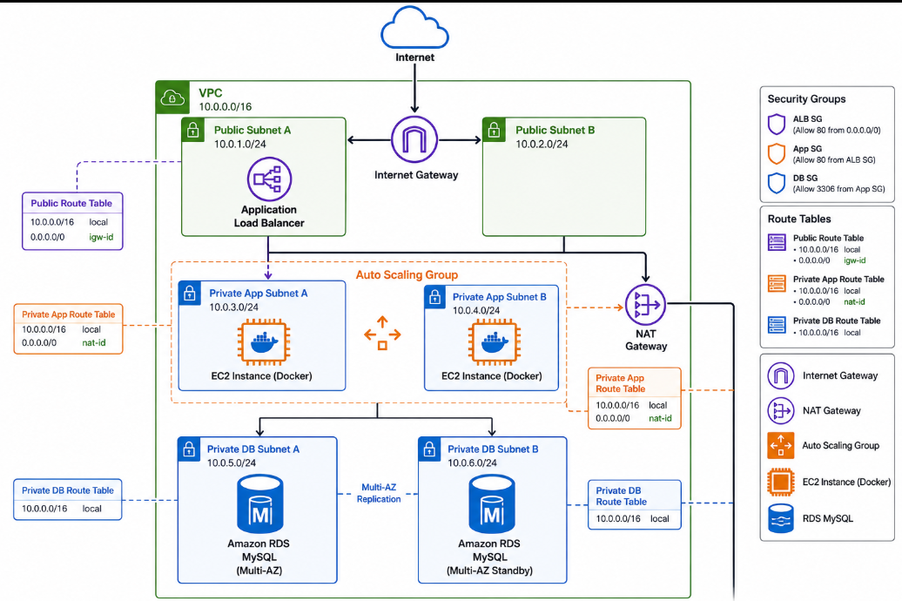
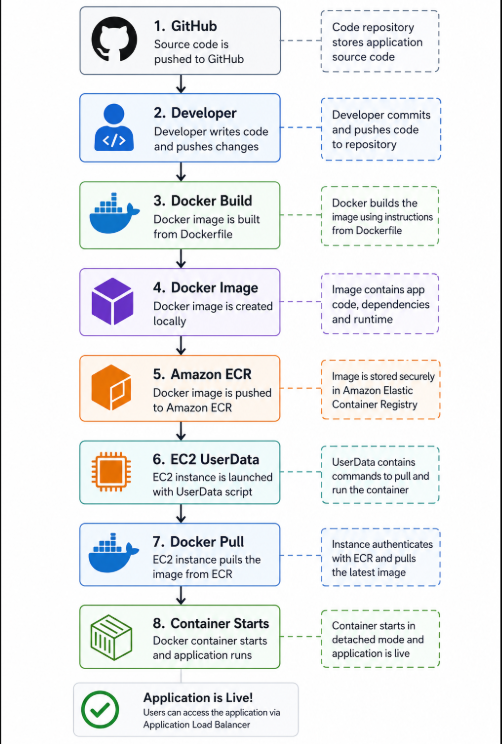
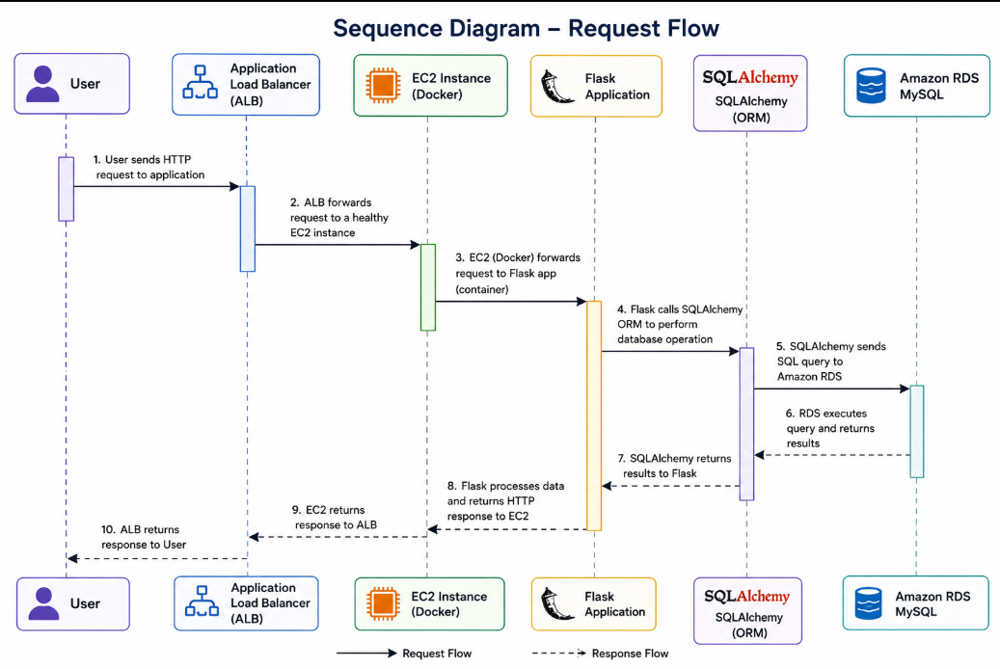

# FinTrust Customer Portal

A production-style cloud application demonstrating the deployment of a containerized Flask web application on AWS using **Terraform**, **Docker**, **Amazon ECR**, **Application Load Balancer**, **Auto Scaling**, and **Amazon RDS**.

This project was built as part of my **80 AWS Projects Roadmap** to gain hands-on experience designing, provisioning, deploying, and troubleshooting production-ready cloud infrastructure.

---

# Project Overview

FinTrust Customer Portal is a simple customer management application that allows users to:

- Add customers
- View customer records
- Edit customer information
- Delete customers

The application is built with Flask and SQLAlchemy, containerized using Docker, and deployed automatically to EC2 instances behind an Application Load Balancer.

---

<h2 align="center">AWS Architecture</h2>

<p align="center">
  
</p>

---

# AWS Architecture

The infrastructure is deployed using Terraform and includes:

- Custom VPC
- Public Subnets
- Private Application Subnets
- Private Database Subnets
- Internet Gateway
- NAT Gateway
- Route Tables
- Security Groups
- Application Load Balancer
- Target Group
- Launch Template
- Auto Scaling Group
- Amazon RDS MySQL
- Amazon ECR
- IAM Roles & Instance Profiles

---

<h2 align="center">Deployment Workflow</h2>

<p align="center">
  
</p>

---

<h2 align="center">Sequence Diagram</h2>

<p align="center">
  
</p>

---
# Technology Stack

## Cloud

- AWS EC2
- Amazon RDS
- Amazon ECR
- Application Load Balancer
- Auto Scaling Group
- VPC
- IAM
- Security Groups
- Route Tables
- NAT Gateway

## Infrastructure as Code

- Terraform

## Backend

- Python
- Flask
- SQLAlchemy

## Database

- MySQL

## Containerization

- Docker

---

# Features

- Customer CRUD Operations
- Containerized Flask Application
- Infrastructure as Code
- Automated EC2 Bootstrapping
- Docker Deployment
- Auto Scaling
- Load Balancing
- Health Check Endpoint
- Environment Variable Configuration
- SQLAlchemy Connection Pooling

---

# Repository Structure

```
fintrust-customer-portal/

├── app/
│   ├── static/
│   ├── templates/
│   ├── __init__.py
│   ├── config.py
│   ├── extensions.py
│   ├── models.py
│   └── routes.py
│
├── docs/
│   ├── architecture.png
│   ├── deployment-diagram.png
│   ├── sequence-diagram.png
│   ├── decisions.md
│   ├── troubleshooting.md
│   └── screenshots/
│
├── terraform/
│   ├── alb.tf
│   ├── autoscaling.tf
│   ├── iam.tf
│   ├── launch_template.tf
│   ├── networking.tf
│   ├── outputs.tf
│   ├── provider.tf
│   ├── rds.tf
│   ├── security.tf
│   ├── userdata.sh
│   └── variables.tf
│
├── Dockerfile
├── requirements.txt
├── run.py
└── README.md
```

---

# Deployment Workflow

```
Developer

     │

Terraform Apply

     │

AWS Infrastructure

     │

Docker Build

     │

Docker Image

     │

Amazon ECR

     │

Launch Template

     │

EC2 User Data

     │

Docker Pull

     │

Application Starts

     │

Application Load Balancer

     │

Users
```

---

# Infrastructure Provisioning

Terraform provisions:

- VPC
- Networking
- Security Groups
- IAM Roles
- Amazon RDS
- Application Load Balancer
- Launch Template
- Auto Scaling Group

Deployment

```bash
terraform init

terraform plan

terraform apply
```

---

# Running the Application Locally

Create a virtual environment

```bash
python -m venv .venv
```

Activate

Windows

```bash
source .venv/Scripts/activate
```

Install dependencies

```bash
pip install -r requirements.txt
```

Run

```bash
python run.py
```

---

# Docker

Build image

```bash
docker build -t fintrust-customer-portal .
```

Run

```bash
docker run -p 5000:5000 \
--env-file .env \
fintrust-customer-portal
```

---

# Amazon ECR

Build

```bash
docker build -t fintrust-customer-portal .
```

Tag

```bash
docker tag fintrust-customer-portal:latest \
<account-id>.dkr.ecr.<region>.amazonaws.com/fintrust-customer-portal:latest
```

Push

```bash
docker push \
<account-id>.dkr.ecr.<region>.amazonaws.com/fintrust-customer-portal:latest
```

---

# Health Check

Endpoint

```
GET /health
```

Response

```json
{
    "status": "healthy"
}
```

Used by the Application Load Balancer to verify instance health.

---

# Security

- Private EC2 instances
- Private RDS database
- Security Groups
- IAM Instance Profile
- Environment Variables
- Managed Database
- Docker Isolation

---

# Documentation

Additional project documentation is available in the **docs/** directory.

- Architecture Diagram
- Deployment Diagram
- Sequence Diagram
- Architecture Decisions
- Troubleshooting Guide

---

# Screenshots

## AWS Infrastructure

- VPC
- Subnets
- NAT Gateway
- Route Tables
- Security Groups
- Load Balancer
- Target Group
- Auto Scaling Group
- Launch Template
- Amazon RDS
- Amazon ECR

## Application

- Home Page
- Add Customer
- Customer List
- Successful CRUD Operations

---

# Challenges Encountered

Some of the real-world engineering challenges solved during this project include:

- ALB 502 Bad Gateway
- Target Group Health Check Failures
- Docker Container Deployment
- Amazon ECR Authentication
- Environment Variable Configuration
- SQLAlchemy Connection Management
- Auto Scaling Deployment
- Amazon RDS Connectivity

See **docs/troubleshooting.md** for detailed explanations.

---

# Lessons Learned

Through this project I gained practical experience with:

- Infrastructure as Code using Terraform
- Designing AWS networking
- Docker containerization
- Deploying containerized applications
- Amazon RDS integration
- Load balancing
- Auto Scaling
- Production application configuration
- Infrastructure troubleshooting
- End-to-end cloud deployments

---

# Future Improvements

Planned enhancements include:

- HTTPS with AWS Certificate Manager
- Route 53 Custom Domain
- AWS Secrets Manager
- CloudWatch Monitoring
- CloudWatch Alarms
- GitHub Actions CI/CD
- ECS Deployment
- Amazon EKS
- Blue/Green Deployments
- AWS WAF
- CloudFront CDN

---

# Project Status

**Completed**

Production-ready portfolio project demonstrating modern AWS infrastructure deployment using Terraform and Docker.

---

# Author

**Simeon Primordial**

Cloud Infrastructure Engineer | AWS Cloud | Terraform | Docker | DevOps

This project is part of my journey to complete **80 AWS Projects** while building production-ready cloud engineering skills.